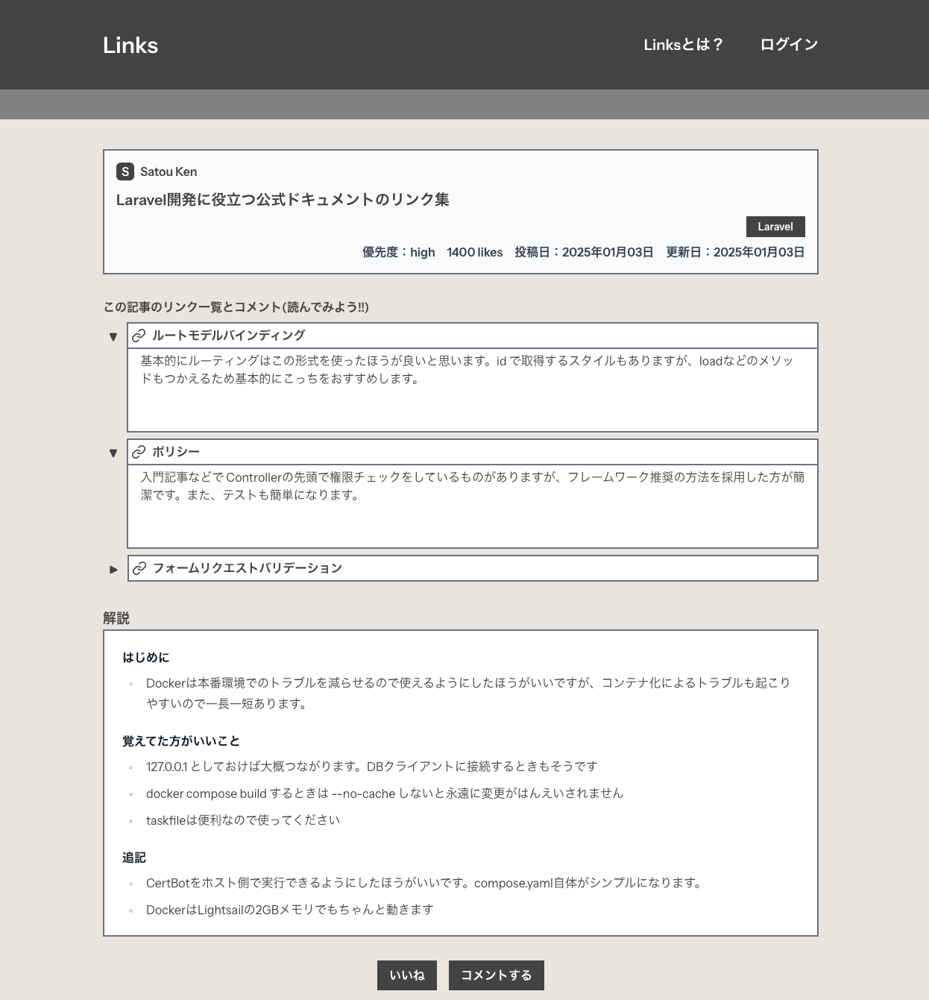

## README(概要版)
#### [※README(詳細版)へ](./docs/index.md) (このアプリの詳細(設計書一覧)が記載されています。)
---
### 目次
- [アプリの概要](#アプリの概要)
- [想定するユースケース](#想定するユースケース)
- [チカラを入れた点](#チカラを入れた点)
- [使用技術](#使用技術)
- [インフラ構成図](#インフラ構成図)
- [ER図](#er図)
- [主要な画面の説明](#主要なページ)
---
### アプリの概要
- 私の作ったアプリ `Links` は「勉強になった記事や技術書のリンクとそれに対するコメントをまとめたもの」を記事として投稿し共有することによって `エンジニアの知識の可視化` を達成することを目的としています。
- 具体的には ユーザー同士が上述した「勉強になったリンクとそれに対するコメント」を記事として投稿することによってお互いの知識が可視化され、共有されるというものです。
- サイトルートページのURL → https://links-azzy.click (レスポンシブ対応済みです)
- アカウントページのURL →  https://links-azzy.click/users/1/articles 
  (このWebアプリはアカウント画面からの流入を主要なものと想定しております。)
- テストアカウント「 id：fuga@gmail.com / pw；fugafuga 」でテストアカウントに入れます。
- ↓記事詳細ページはこんなかんじでリンクとそれに対するそれぞれのコメントそして全体を通してのコメントを入力することができます。

#### [目次に戻る](#目次)
---
### 想定するユースケース
#### ケース１
- とあるエンジニアの方の技術記事やプロポーザルを見た場合、にその内容が自分の知識不足で理解できなかった。
→ Linksのその人のアカウントを見ればその人の知識が可視化されている(その人の勉強になった記事や技術書が記事としてまとめられている)ので、
それを読むことにより、そのエンジニアの方の技術記事やプロポーザルを理解できます。
#### ケース2 
- あるプロジェクトに入るときに先輩やメンバーのLinksのアカウントページを見てそこにある記事とそこに付随するリンクを読めば、知識が事前に共有され開発が円滑に進むと思います。
#### [目次に戻る](#目次)
---
### チカラを入れた点
- 多数の既存サイトを参考にしてモダンなUIを目指した。
- Docker上に実装することで開発環境の安定化と本番環境における展開の簡易化を目指した。
- テストはPHPUnitのラッパーでBDDを意識したPestを使い、効率的に実装した。 また、Docker上でテスト用拡張機能を使ってそのまま実行できるよう、環境構築をした。
- Laravelのベストプラクティスを実践し、フォームリクエストバリデーションやポリシーなど責務を分割して実装した。
- 必要なドキュメントを整備しながら実装した。特にFigmaを使いデザインカンプを先に作成することによって、開発速度の上昇を実現できた。
#### [目次に戻る](#目次)
---
### 使用技術
- [技術選定書へ](./docs/techSelection.md)
#### [目次に戻る](#目次)
---
### インフラ構成図
- [インフラ構成図へ](./docs/infraPicture.md)
#### [目次に戻る](#目次)
---
### ER図
- [ER図へ](./docs/er.md)
#### [目次に戻る](#目次)
---
### 主要なページ
#### (アカウント詳細ページ、記事詳細ページ、ダッシュボード、記事作成ページetc)
---
- アカウント詳細ページ(このサイトはここのアカウント詳細ページからの流入を主に想定しております。)
- 記事を優先度順にソートできるため、優先度の高い記事から読んでいけます。

---
- 記事詳細ページ(リンクとそれに対するコメントをそれぞれ作成できます。)

--- 
- ダッシュボード(ログイン中のユーザーの操作が集約されています)

---
- 記事作成編集画面(ジャンルとリンクはボタンで追加したり削除したりできます。本文はmarkdownがプレビューされます。)

#### [目次に戻る](#目次)